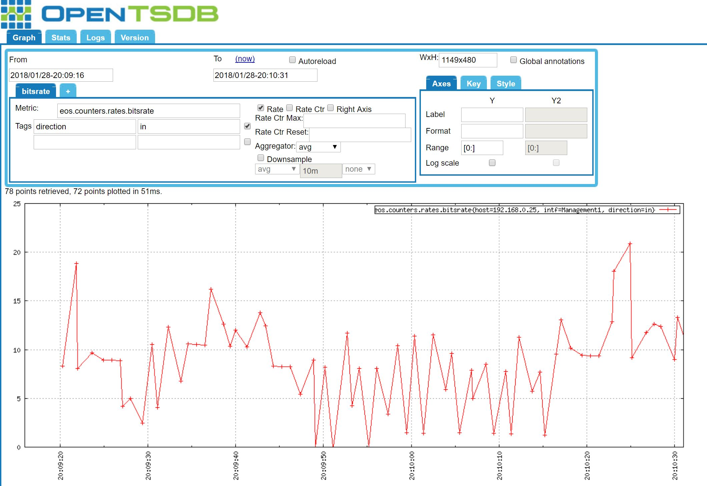

# octsdb

On this repo there are two compiled versions of Arista's octsdb client: https://github.com/aristanetworks/goarista/tree/master/cmd/octsdb

"octsdb" works on a linux 64 build, where as "octsdb-arista" can be run directly on the Arista switch.

`ebad7ff5a12bdb93b638efaeb282db4b  octsdb`

`081f38956dcaad0355b126fdf97e01d1  octsdb-arista`

This client subscribes to TerminAttr - gRPC OpenConfig - and writes the metrics to OpenTSDB

# Example usage:

This explains how to get a POC up and running using OpenTSDB in a docker container

Download and run OpenTSDB docker image:

```
docker pull jpdurot/opentsdb
docker run -d -p 4242:4242 jpdurot/opentsdb:latest
```

Find out the name of the container:

```
[root@server tmp]# docker ps
CONTAINER ID        IMAGE                                  COMMAND                  CREATED             STATUS                  PORTS                                                           NAMES
bcec9674d430        jpdurot/opentsdb:latest                "/run.sh"                5 hours ago         Up 5 hours                                                                              sharp_golick
                                                            sharp_golick
```

Now load up a bash shell within the container so we can make some metrics. eos.counters.rates(bitsrate|pktsrate) is used in the sample.json file. 

```
docker exec -t -i sharp_golick /bin/bash
/usr/share/opentsdb/bin/tsdb mkmetric eos.counters.rates.bitsrate
/usr/share/opentsdb/bin/tsdb mkmetric eos.counters.rates.pktsrate
```

Finally, resolve the IP address of the OpenTSDB container:

```
docker inspect --format '{{.NetworkSettings.IPAddress}}' sharp_golick
```

Now within the Arista switch go in to bash and running the following command:

```
enable
bash
sudo su
/usr/bin/TerminAttr -grpcaddr 0.0.0.0:6042 -allowed_ips 0.0.0.0/0 -disableaaa
```

Finally, on the docker host clone this repo

```
git clone https://github.com/grahamneville/octsdb.git
```

If you wish to run octsdb-arista directly on the swtich you will have to manually scp the files over to the switch.

```
scp gneville@192.168.1.1:/home/gneville/octsdb-arista octsdb-arista
scp gneville@192.168.1.1:/home/gneville/sample.json sample.json
```


If running octsdb on the docker host use the below command filling in the Arista switch ip and OpenTSDB container IP addresses:

```
./octsdb -addrs <arista_switch_ip>:6042 -config sample.json -v 4 -tsdb <opentsdb_container_ip>:4242
```

If running octsdb-arista on the Arista switch use the below command:

```
./octsdb-arista -addrs localhost:6042 -config sample.json -v 4 -tsdb <opentsdb_container_ip>:4242
```


Now browse to the OpenTSDB container IP in a web browser on port 4242. e.g. http://192.168.1.100:4242
Then in the metric field type "eos.counters.rates.bitsrate", click on rate and set a tag of "direction" and "in".
Finally set start time being 10 mins ago, and to time as now. 
You should then see graph points coming through, if you click "now" or "autoreload" the graph will be populated with extra points as they come through.




# daemonising

It's possible to have this client start automatically on the switch and persist reboots by adding the following config on the switch.
You can change the binary and json files as you please.

```
daemon octsdb
   exec /home/admin/octsdb-arista -addrs <arista_switch_ip>:6042 -config /home/admin/sample.json -v 4 -tsdb <opentsdb_container_ip>:4242
   no shutdown
```

Don't forget to daemonise Terminattr as well

```
daemon terminattr
   exec /usr/bin/TerminAttr -grpcaddr 0.0.0.0:6042 -allowed_ips 0.0.0.0/0 -disableaaa
   no shutdown
```


# sample.json file usage

```
{
        "comment": "This is a sample configuration",
        "subscriptions": [
                "/Smash/counters/ethIntf/PhyEthtool-1/current/"
        ],
        "metricPrefix": "eos",
        "metrics": {
                "test": {
                        "path": "/Smash/(counters)/ethIntf/PhyEthtool-1/current/counter/(?P<intf>.+)/(rates)/(?P<direction>(?:in|out))(BitsRate|PktsRate)"
                }
        }
}
```

This gives a simple overview of how the translation of the OpenConfig to OpenTSDB metrics works.

 - metricPrefix is the starting name of the metrics
 - Anything in parentheses "()" are added to the metric patch
 - Anything in chevrons "<>" are tags

So in the above example:
 - the metrics will be eos.counters.rates.bitsrate & eos.counters.rates.bitsrate.
 - the tages will be the interface name (<intf>) and the direction (<direction>(?:in|out))
